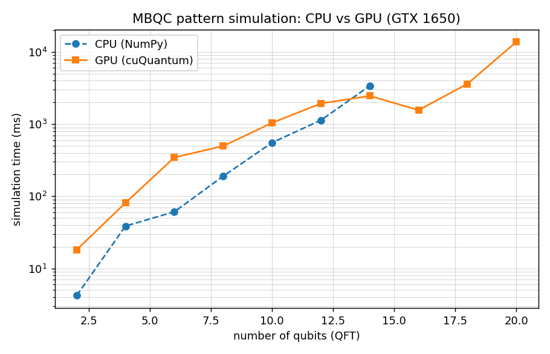

# graphix-statevec-cuquantum

GPU-accelerated state vector backend for [Graphix](https://github.com/TeamGraphix/graphix) pattern
simulation, built on NVIDIA [cuQuantum](https://developer.nvidia.com/cuquantum-sdk) (cuStateVec)
and [CuPy](https://cupy.dev/).

## Requirements

- An NVIDIA GPU with compute capability ≥ 7.0 and CUDA 12.x.
- Python ≥ 3.13.
- `cupy-cuda12x` and `cuquantum-python-cu12` (installed by the `cuquantum` extra).

## Installation

```bash
uv sync --extra cuquantum --dev
```

## Usage

```python
from graphix.transpiler import Circuit

from graphix_statevec_cuquantum import StatevectorBackend

circuit = Circuit(2)
circuit.cnot(0, 1)
circuit.h(0)
pattern = circuit.transpile().pattern

state = pattern.simulate_pattern(backend=StatevectorBackend())
print(state.flatten())
```

For pattern simulation it is recommended to preallocate the device buffer to the pattern's maximum
space, which avoids reallocations as qubits are added and removed:

```python
backend = StatevectorBackend.with_capacity(pattern.max_space())
state = pattern.simulate_pattern(backend=backend)
```

## Design

### State representation

The state is a flat CuPy array of constant size `2**max_space` and `complex128` dtype. Only the
first `2**nqubit` entries are meaningful; the remainder is padding so that the active register can
grow (`N` commands) and shrink (`M` commands) without reallocating GPU memory. `flatten()` copies
the active slice back to the host as a NumPy array.

### Qubit ordering

Graphix uses the most-significant-bit convention (qubit `0` is tensor axis `0`); cuStateVec uses
the least-significant-bit convention. Indices are converted with `_msb_to_lsb` before every
cuStateVec call.

### cuStateVec usage

| Operation | cuStateVec / CuPy |
|---|---|
| single- and multi-qubit gates, CZ entanglement | `custatevec.apply_matrix` (workspace sized via `apply_matrix_get_workspace_size`) |
| single-qubit expectation value | `custatevec.compute_expectation`, divided by the squared norm |
| qubit removal after measurement, swap, tensor | CuPy reshape / slice / `swapaxes` / `kron` |

The cuStateVec handle and the device gate constants are created lazily, so importing the module
never touches the GPU (CI runners without a device can still import and type-check it).

### Specializations

- `add_nodes` has a device-only fast path for the common case of adding a single `|+>` qubit
  (i.e. an `N` command), avoiding any host-to-device transfer.
- `StatevectorBackend.with_capacity(max_qubits)` preallocates the buffer for pattern simulation.

## Benchmarks

End-to-end MBQC simulation of the QFT benchmark (from
[`graphix-mqtbench`](https://github.com/matulni/graphix-mqtbench), with the `min_space` optimization
pass), comparing the reference NumPy CPU backend against this cuQuantum backend on an NVIDIA
GTX 1650 (4 GB). GPU timings are taken with explicit `cupy.cuda.Device().synchronize()`; each point
is the fastest of three runs. Reproduce with:

```bash
uv run python benchmarks/compare_cpu_gpu.py
```

| qubits | max space | CPU (ms) | GPU (ms) | speed-up |
|---|---|---|---|---|
| 2 | 3 | 4.2 | 18.1 | 0.2x |
| 4 | 5 | 38.6 | 81.2 | 0.5x |
| 6 | 7 | 61.0 | 345.4 | 0.2x |
| 8 | 9 | 190.1 | 496.3 | 0.4x |
| 10 | 11 | 553.4 | 1039.0 | 0.5x |
| 12 | 13 | 1132.1 | 1930.5 | 0.6x |
| 14 | 15 | 3382.5 | 2460.2 | 1.4x |
| 16 | 17 | — | 1562.9 | — |
| 18 | 19 | — | 3614.3 | — |
| 20 | 21 | — | 13722.7 | — |



For small patterns the CPU backend wins: each MBQC command is a tiny operation, and the GPU's
fixed per-call overhead (kernel launch, workspace query) dominates. The crossover is around 14
qubits, after which the CPU cost grows steeply — at 16 qubits the CPU backend did not finish a
single QFT simulation within 15 minutes, whereas the GPU backend reaches 20 qubits in ~14 seconds.
The value of the GPU backend is therefore reaching pattern sizes that are impractical on the CPU,
rather than accelerating small ones. (Timings are noisy and hardware-dependent; the 4 GB GTX 1650
used here is an entry-level card.)

## Caveats

- This backend targets **cuQuantum Python 26.x** (`cuquantum.bindings.custatevec`). Earlier (24.x)
  releases that expose `cuquantum.custatevec` are not compatible.
- The backend does not implement `apply_noise` (no noise model).
- A CUDA device is required at run time. The test suite is decorated so that it is skipped when no
  GPU is available; the maintainers run it offline on a GPU.

## Testing

```bash
uv run pytest tests/
```

Tests compare every operation against the reference `graphix.sim.statevec` backend and verify full
pattern-simulation equivalence. They are skipped automatically on machines without a GPU.
